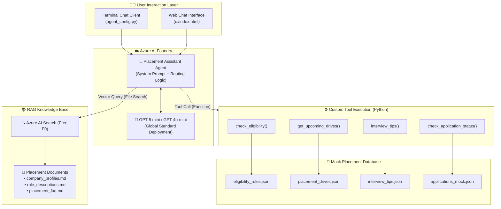

# 🎓 Campus Placement Assistant

An AI-powered placement companion and career guidance agent built for college engineering students. Orchestrated via **Azure AI Foundry (Agent Service)**, powered by **GPT-5 mini / GPT-4o-mini**, grounded with **Azure AI Search (RAG)**, and equipped with custom deterministic **Python Tool Calling Functions**.

Developed as an **Azure AI-103 (Azure AI Engineer Associate)** capstone project (#30 from the curriculum project list).

---

## 📌 Table of Contents
- [Overview](#overview)
- [System Architecture](#system-architecture)
- [Key Features](#key-features)
- [Project Directory Structure](#project-directory-structure)
- [Tech Stack](#tech-stack)
- [Prerequisites & Azure Setup](#prerequisites--azure-setup)
- [Local Installation & Configuration](#local-installation--configuration)
- [How to Run](#how-to-run)
- [Tool Function Reference](#tool-function-reference)
- [AI-103 Concepts Demonstrated](#ai-103-concepts-demonstrated)
- [Responsible AI & Guardrails](#responsible-ai--guardrails)

---

## 📖 Overview

Navigating campus placements is stressful for students: eligibility criteria vary across companies, recruitment dates shift, interview rounds follow different patterns (product vs. service vs. consulting), and application status updates are scattered.

The **Campus Placement Assistant** solves this by acting as a 24/7 intelligent placement counselor:
- **Instant Eligibility Verification**: Evaluates CGPA cutoffs, department restrictions, and backlog limits without guessing.
- **Drive Schedule Discovery**: Filters upcoming recruitment visits by department and eligibility.
- **Round-Wise Interview Preparation**: Delivers targeted tips, common DSA topics, and curated study sheets for top recruiters.
- **Application Tracking**: Allows students to check their application pipeline and scheduled interview rounds.
- **Company & Role Insights via RAG**: Unpacks corporate work culture, typical packages, and recruitment stages from indexed placement documents.

---

## 🏗️ System Architecture



---

## ✨ Key Features

| Feature | Execution Mechanism | Description |
|---|---|---|
| **Eligibility Checker** | Custom Tool (`check_eligibility`) | Verifies CGPA, branch, and backlogs against company rules with case-insensitive and alias-aware matching. |
| **Upcoming Drives** | Custom Tool (`get_upcoming_drives`) | Lists chronological campus recruitment drives filtered by student branch and CGPA qualification. |
| **Interview Prep Tips** | Custom Tool (`interview_tips`) | Provides round formats, focus areas, and curated preparation roadmaps for companies and company tiers. |
| **Application Tracker** | Custom Tool (`check_application_status`) | Queries mock student application pipelines (STU001-STU006) for active stages and next steps. |
| **Company & Role Info** | RAG (`file_search` / AI Search) | Answers detailed questions on Indian tech offices, package breakdowns, and work culture from documents. |
| **Resume Guidance** | Direct LLM Generation | Evaluates project descriptions and highlights skills using the STAR action-verb framework. |
| **Out-of-Scope Defense** | System Prompt Guardrail | Politely redirects non-placement questions to the college T&P Cell (`placement@college.edu`). |

---

## 📁 Project Directory Structure

```
campus-placement-assistant/
├── agent/
│   ├── agent_config.py          # Azure AI Foundry Agent setup & interactive chat loop
│   └── system_prompt.txt        # Comprehensive agent system prompt with routing rules
├── data/
│   ├── applications_mock.json   # Mock student application records (STU001 - STU006)
│   ├── eligibility_rules.json   # 10 company academic cutoffs and criteria
│   ├── interview_tips.json      # Round breakdown, tips, and links for 12+ targets
│   └── placement_drives.json    # Scheduled placement drives for Oct-Nov 2026
├── docs/                        # Markdown documents indexed in Azure AI Search for RAG
│   └── company_profiles.md      # Detailed recruiter profiles (Google, Microsoft, Amazon, etc.)
├── tools/
│   ├── tool_functions.py        # Core Python implementations of the 4 placement tools
│   └── tool_schemas.json        # OpenAI-compatible JSON function definitions
├── ui/
│   ├── app.js                   # Frontend chat logic, API integration, and rendering
│   ├── index.html               # College-themed responsive chat interface
│   └── style.css                # Modern UI styles with animations and markdown badges
├── .env.example                 # Template for environment variables and API keys
├── requirements.txt             # Python dependencies (Azure SDKs + dotenv)
└── README.md                    # Project documentation
```

---

## 🛠️ Tech Stack

- **Cloud Platform**: Microsoft Azure
- **Agent Orchestration**: Azure AI Foundry Agent Service (`azure-ai-projects`, `azure-ai-agents`)
- **Language Models**: OpenAI GPT-5 mini / GPT-4o-mini
- **Vector Search / RAG**: Azure AI Search (Free F0 tier)
- **Backend & Logic**: Python 3.10+
- **Frontend**: Vanilla HTML5, CSS3, JavaScript (no heavy node_modules build step required)

---

## ☁️ Prerequisites & Azure Setup

### 1. Azure AI Foundry Hub & Project
1. Log in to the [Azure Portal](https://portal.azure.com).
2. Search **Azure AI Foundry** → Click **+ Create**.
3. Select your subscription (**Azure for Students**), create resource group `rg-placement-assistant`, choose region (**East US** or **Korea Central**), name the hub `placement-hub`.
4. Click **Review + Create**.
5. Once deployed, open the Foundry portal ([ai.azure.com](https://ai.azure.com)), enter your hub, and create project `campus-placement-assistant`.

### 2. Deploy Model (GPT-5 mini or GPT-4o-mini)
1. Inside your project at [ai.azure.com](https://ai.azure.com), navigate to **Models + endpoints** (or **Deployments**).
2. Click **+ Deploy model** → **Deploy base model**.
3. Select **GPT-5 mini** (or **GPT-4o-mini**).
4. Name the deployment `gpt-5-mini` with deployment type **Global Standard** and TPM limit set to `10K`.
5. Click **Deploy**.

### 3. Azure AI Search (Free F0 Tier)
1. In the [Azure Portal](https://portal.azure.com), search for **Azure AI Search** → Click **+ Create**.
2. Set Resource Group to `rg-placement-assistant` and Location to match your region.
3. ⚠️ **Under Pricing Tier**: Click **Change Pricing Tier** and select **Free (F0)** to avoid unintended charges.
4. Review and create the service.

---

## 💻 Local Installation & Configuration

### 1. Clone or Navigate to the Project
```bash
cd C:\Users\chitv\.gemini\antigravity\scratch\campus-placement-assistant\
```

### 2. Set Up a Python Virtual Environment
```bash
# Create virtual environment
python -m venv venv

# Activate on Windows (PowerShell)
.\venv\Scripts\Activate.ps1

# Or activate on Windows (Command Prompt)
.\venv\Scripts\activate.bat
```

### 3. Install Required Dependencies
```bash
pip install -r requirements.txt
```

### 4. Configure Environment Variables
Copy `.env.example` to `.env` and fill in your keys:
```bash
copy .env.example .env
```
Edit `.env` with your values:
```env
AZURE_PROJECT_ENDPOINT="https://placement-hub.services.ai.azure.com/api/project"
AZURE_API_KEY="your_azure_ai_foundry_api_key"
AZURE_MODEL_DEPLOYMENT="gpt-5-mini"
AZURE_SEARCH_ENDPOINT="https://placement-search.search.windows.net"
AZURE_SEARCH_KEY="your_azure_ai_search_key"
```

---

## 🚀 How to Run

### Option A: Interactive Agent Chat (CLI)
Run the agent runner script:
```bash
python agent/agent_config.py
```
- **With Live Azure Credentials**: The script connects to Azure AI Foundry, registers tool functions, initiates an agent thread, and processes queries with real-time tool calling.
- **Without Azure Credentials (Offline Demo)**: The script automatically boots in **Local Simulation Mode**, executing all 4 Python tool functions against local JSON files, perfect for immediate evaluation and local testing.

### Option B: Test Tool Functions Directly
Run Python to test individual tool functions:
```bash
python -c "from tools.tool_functions import check_eligibility; print(check_eligibility('Google', 8.5, 'CSE'))"
```

### Option C: Launch Web Chat UI
Simply open `ui/index.html` in any modern web browser, or launch a quick local server:
```bash
python -m http.server 8000 --directory ui
```
Then visit `http://localhost:8000` in your browser.

---

## 🔧 Tool Function Reference

### 1. `check_eligibility`
```python
check_eligibility(company: str, cgpa: float, branch: str, backlogs: int = 0) -> dict
```
- **Lookup**: Case-insensitive partial matching with support for acronyms (e.g. "TCS" → "Tata Consultancy Services").
- **Checks**: Evaluates `cgpa >= min_cgpa`, branch in `allowed_branches`, and `backlogs <= max_backlogs_allowed`.
- **Output**: Returns `{"eligible": bool, "reason": str, "company_details": dict}`.

### 2. `get_upcoming_drives`
```python
get_upcoming_drives(branch: str = None, min_cgpa: float = None) -> list
```
- **Filters**: Optionally filters by student's branch and displays drives where `eligibility_cgpa <= min_cgpa`.
- **Output**: Returns a chronological list of scheduled recruitment drives with roles, CTC, dates, and venues.

### 3. `interview_tips`
```python
interview_tips(company_or_role: str) -> dict
```
- **Lookup**: Searches recruiter names (`Google`, `Microsoft`, `Amazon`, etc.) and company categories (`product`, `service`, `consulting`, `startup`, `finance`).
- **Output**: Returns round-by-round interview structures, common DSA/system design questions, and curated preparation links.

### 4. `check_application_status`
```python
check_application_status(student_id: str) -> dict
```
- **Lookup**: Case-insensitive lookup of college student IDs (`STU001` - `STU006`).
- **Output**: Returns student's active job applications, round statuses (Applied, Shortlisted, Selected), and scheduled next steps.

---

## 🎯 AI-103 Concepts Demonstrated

This project showcases practical implementation of core Microsoft AI-103 exam domains:

1. **Azure AI Foundry Architecture**: Hub, Project, and Model Deployment lifecycle management.
2. **AI Agent Development**: Multi-turn agent configuration with structured system prompts.
3. **Deterministic Function Calling**: Connecting LLMs to external JSON data repositories using OpenAI/Azure tool schemas.
4. **Retrieval-Augmented Generation (RAG)**: Grounding conversations on external enterprise knowledge bases via Azure AI Search.
5. **Cost & Resource Governance**: Utilizing Free tier AI Search (F0) and token-efficient models (GPT-5 mini / GPT-4o-mini) to stay well within student credit limits.

---

## 🛡️ Responsible AI & Guardrails

- **Domain Boundaries**: The agent strictly restricts answers to placement, career guidance, and academic eligibility.
- **Safety & PII**: All student names and numbers are synthetic mock records (`STU001` - `STU006`) with no real student personal data.
- **Transparent Citations**: Every response includes an explicit source citation (e.g., `*Data Source: T&P Placement Eligibility Database*`) to ensure explainability and prevent hallucination.
